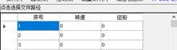
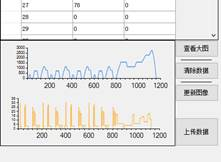
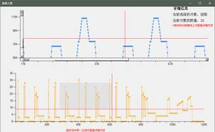
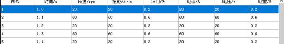
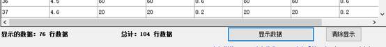
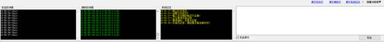
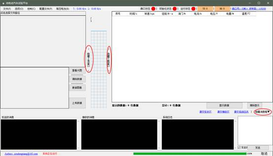
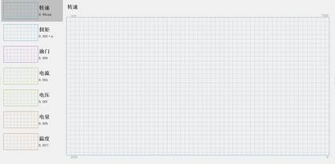

# 关于NEDC软件的使用帮助

## 一、用户设备的注册于登录

关于软件加密与解密授权内容已取消, 但是保留了生成机器码的功能, 以后可以参考

## 二、软件功能介绍

### 1）、菜单栏

1、文件：可选择导出已经测量得到的数据结果，导出文件格式为CSV

2、选项：选项中包含配置串口属性、打开串口与关闭串口

3、控制：在串口打开后应进行 控制-测试连接 与设备进行连接测试

测试连接工作完成后可选择启动设备或停止设备

4、配置文件：在启动设备前应选择 配置文件-打开配置文件 选择需要载入到设备的CSV文件，该文件应该仅有三列，列名为：序号、转速、扭矩

5、高压电池：开启或关闭高压电池将发送相应的指令到设备

6、上传下载速度显示

7、串口打开状态：红色为未打开，绿色为打开

8、初始化状态：完成测试连接后变为绿色，停止设备或关闭串口后需要重新连接，同时图标变为红色

9、运行状态，在开启串口并完成连接测试后变为绿色，否则为红色

10、发送计数：通过串口发出消息后，将产生计数，并会高亮100ms，随后变暗视为脉冲，当把鼠标移动到上面时可查看带有单位的计数值，例如

11、接收计数：效果同发送计数，所有效果在接收消息后触发

12、串口属性：显示串口的基础属性，鼠标移动到上面后可查看串口详细属性，点击可配置串口属性，效果同 选项-配置串口属性

### 2）、上传区

1、点击选择文件路径：效果同 配置文件-打开配置文件，选择一个需要载入到设备的CSV文件，要求载入文件的第一列（序号列）为连续不间断的整数数值，否则将会报错。

2、在数据表区域可查看、新增、修改数据，当数据值发生变动后，图表区的变化将会同步发生变动（如果没有刷新，可尝试手动点击 更新图像 按钮）

3、在上传数据前应确保数据的正确性，可点击 查看大图，在弹出的窗口中查看详细的数据曲线。（加载数据曲线可能会消耗一定的电脑资源）

4、在弹出的窗口中可看到详细的数据曲线，把鼠标移动到曲线上可看到该曲线在该点的具体值，同时鼠标拖动图表区可实现局部放大。

5、确保数据值无误口，可点击 上传数据（或 配置文件-开始上传）准备上传数据，点击后将出现提示框，以供用户查看具体上传的数据量

6、可在 配置文件 设定上传时间间隔，以 毫秒 为单位

### 3）、下载区

1、上位机收到消息后将不会自动在下载区域显示、如果需要查看下载数据可点击（显示数据）将已获取的数据显示到表格中，如果需要保存数据到本地可选择 文件-导出实验数据 进行保存

2、为了节约计算资源，在不需要显示数据时可选择清除显示，则可清除列表中的数据

3、区域左下角显示当前显示的数据量和已成功接收的数据量

### 4）、消息区

1、系统在运行中发送的消息、接收的消息、产生的操作信息将都在这个区域显示

2、显示格式为：Time->Message，过长的消息将被忽略无法查看

3、右侧有串口调试助手，可在编辑区写入字符串格式内容，点击 发送 可通过串口将内容发送到设备，发送记录和接收记录均可在左侧查看

4、发送消息时可选是否自动换行，如果选择自动换行将不需要手动添加换行符

5、如果需要清空消息了电机右上方的清除按钮

### 5）、状态区

1、最左侧为作者邮箱

2、其次为当前的消息，该消息会在消息区记录。

3、进度条显示当前的进度，例如发送文件时已完成的百分比

4、在等待应答或发送配置文件时可取消当前操作，需注意，在发送配置文件时如果取消操作是立即取消的，将不会发送终止消息，所以点击前请慎重！

 

### 6）、边缘区

在不需要显示边缘区的时候可点击隐藏按钮，点击后将自动在边缘隐藏，如果需要显示可再次点击显示按钮

在区域边缘附近鼠标指针将变成或通过拖动可改变区域大小，下次点击显示时将以最后一次拖动的大小显示区域

在鼠标指针变成或后，通过双击可恢复默认大小

### 7）、数据显示区

1、左侧图表区的显示有效时长为10秒，即显示最近10秒的数据

2、左侧名称下显示当前的具体数值

3、通过点击左侧的图表，可将其放大显示到右侧图表，右侧图表的显示时间范围为60秒，即显示最近60秒的数据

4、右侧图表左上角显示该量的单位，右上角显示最大值，左下角显示时间长度、右下角显示该量的最小值

## 三、通讯协议定义

### 1）、测试连接

上位机发送：Init

下位机返回：OK或Error，若返回Error:Message，将弹出消息框提示设备异常

### 2）、启动设备

上位机发送：Start

下位机返回：OK或Error，若返回Error:Message，将弹出消息框提示设备异常

### 3）、停止设备

上位机发送：Stop

下位机返回：OK或Error，若返回Error:Message，将弹出消息框提示设备异常

### 4）、打开高压电池

上位机发送：Open

下位机返回：OK或Error，若返回Error:Message，将弹出消息框提示设备异常

### 5）、关闭高压电池

上位机发送：Close

下位机返回：OK或Error，若返回Error:Message，将弹出消息框提示设备异常

### 6）、关于以上通讯协议

1、以上通讯协议所发送、接收的内容全部为英文字符和标点构成

2、上位机在进行以上通讯时，将发送命令到设备，若设备在1秒内无回复将继续发送，持续10次，即10秒内无任何应答则视为超时

3、下位机返回的OK和Error不区分不小写，格式为 属性+冒号+内容+分号 例如：  OK:I Get The Message!;（表示应答成功）

​    Error: I Didn't Get the Message!;（表示应答成功但设备异常）

​    Attributes:Values;（表示无效信息，不做应答）

### 7）、上传配置文件

1、需要首先导入 需要上传的CSV文件

2、只有在串口打开时才允许生成上传配置文件

3、上传配置文件不需要设备应答，上传间隔由用户设定，默认100ms

4、上传的数据以字符串格式发送，以换行符结尾，以分号分割，每一区域为标准4位长度，高位不足补“0”；例如：0010；0020；

5、发送前将发送指令：Upload 表示即将准备上传文件，发送完成后发送End表示已发送完毕

6、上传文件前将生成上传格式集，供用户查看上传格式

7、上传的数据不包含行列号，仅包含数据，长度为9个字节的长度

### 8）、获取设备测量数据

1、设备反馈的数据应为10组/秒

2、每组数据由7个元素，每两个元素以分号分割，以换行符结尾；例如：60;60;60;60;60;60;60;

3、发送到上位机的数据元素个数不正确时将不会绘制图形，只能在消息区查看收到的消息

4、上位机接收的数据不能清除，所以在上位机获取到数据后如需再次进行试验，请重新启动软件

5、不在初始设定的数据范围内的数据将无法显示，但可以导出

